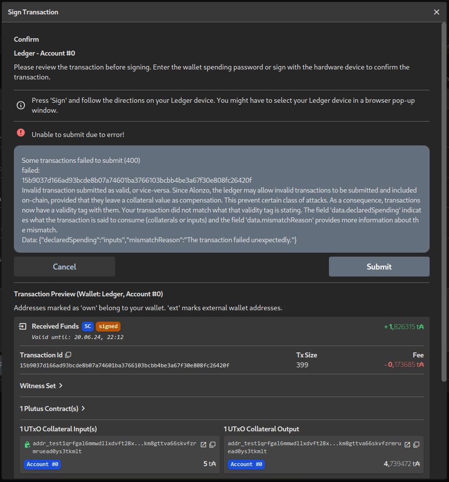

# The Most Trivial Aiken Validators
This very tiny toy project implements the two most trivial Cardano
validators in Aiken – one that always succeeds, lets everyone execute a
transaction without any restrictions, and one that always fails, lets
nobody execute a transaction and locks assets forever, “burns” them.

Aiken's homepage is [https://aiken-lang.org/](https://aiken-lang.org/)
which also contains a lot of good “getting started” documentation and the
standard library (which we do not even have to use in these trivial
examples) is documented at
[https://aiken-lang.github.io/stdlib/](https://aiken-lang.github.io/stdlib/).

After starting a new project with `aiken new heptasean/aiken-trivial`, I have
implemented these validators in `validators/trivial.ak`.
The source code are just 19 lines – including equally trivial test cases for
both of them:
```gleam
validator {
  fn always_succeeds(_datum: Data, _redeemer: Data, _context: Data) -> Bool {
    True
  }
}

test succeeds() {
  always_succeeds(Void, Void, Void)
}

validator {
  fn always_fails(_datum: Data, _redeemer: Data, _context: Data) -> Bool {
    False
  }
}

test fails() fail {
  always_fails(Void, Void, Void)
}
```

## Testing and Building
To run the tests (and generally check everything else is okay), we can use
`aiken check`:
```shell
$ aiken check
    Compiling hepta/trivial 1.0.0 (/home/sean/Cardano/Repos/aiken-trivial)
      Testing ...

    ┍━ trivial ━━━━━━━━━━━━━━━━━━━━━━━━━━━
    │ PASS [mem: 200, cpu: 23100] succeeds
    │ PASS [mem: 200, cpu: 23100] fails
    ┕━━━━━━━ 2 tests | 2 passed | 0 failed

      Summary 2 checks, 0 errors, 0 warnings
```

And then `aiken build` can be used to actually build the validators:
```shell
$ aiken build
    Compiling hepta/trivial 1.0.0 (/home/sean/Cardano/Repos/aiken-trivial)
   Generating project's blueprint (/home/sean/Cardano/Repos/aiken-trivial/plutus.json)
      Summary 0 errors, 0 warnings
```

The main result of this is the blueprint JSON file `plutus.json` containing
the compiled bytecode, the hashes, and some metadata about our two
validators.

## Addresses and Plutus Files
We can use `aiken address` to get the addresses for these validators:
```shell
$ aiken address --validator trivial.always_succeeds
addr_test1wquu2gxsvfa2lfeg7ljd6yq59dmuy4up8sm02l3vhz8h9fg4q3ckq
      Summary 0 errors, 0 warnings
$ aiken address --validator trivial.always_succeeds --mainnet
addr1wyuu2gxsvfa2lfeg7ljd6yq59dmuy4up8sm02l3vhz8h9fgwg9ye9
      Summary 0 errors, 0 warnings
$ aiken address --validator trivial.always_fails
addr_test1wpn2vamfahgv2n2ldmyt5wf9899lpe8ur79lhcapx844y0qrnvrgh
      Summary 0 errors, 0 warnings
$ aiken address --validator trivial.always_fails --mainnet
addr1w9n2vamfahgv2n2ldmyt5wf9899lpe8ur79lhcapx844y0qcmcl8j
      Summary 0 errors, 0 warnings
```

As it turns out when checking on Cardanoscan, both of them have been used
before on all of the networks:
| Validator         | Mainnet | Preprod | Preview |
| ----------------- | ------- | ------- | ------- |
| `always_succeeds` | [addr1wyu…wg9ye9](https://cardanoscan.io/address/7139c520d0627aafa728f7e4dd10142b77c257813c36f57e2cb88f72a5) | [addr_test1wqu…4q3ckq](https://preprod.cardanoscan.io/address/7039c520d0627aafa728f7e4dd10142b77c257813c36f57e2cb88f72a5) | [addr_test1wqu…4q3ckq](https://preview.cardanoscan.io/address/7039c520d0627aafa728f7e4dd10142b77c257813c36f57e2cb88f72a5) |
| `always_fails`    | [addr1w9n…cmcl8j](https://cardanoscan.io/address/7166a67769edd0c54d5f6ec8ba3925394bf0e4fc1f8bfbe3a131eb523c) | [addr_test1wpn…rnvrgh](https://preprod.cardanoscan.io/address/7066a67769edd0c54d5f6ec8ba3925394bf0e4fc1f8bfbe3a131eb523c) | [addr_test1wpn…rnvrgh](https://preview.cardanoscan.io/address/7066a67769edd0c54d5f6ec8ba3925394bf0e4fc1f8bfbe3a131eb523c) |

In order to use these validators with `cardano-cli`, we need them in the
file format used by that. We can get it through `aiken blueprint convert`:
```shell
$ aiken blueprint convert --validator trivial.always_succeeds
{
  "type": "PlutusScriptV2",
  "description": "Generated by Aiken",
  "cborHex": "52510100003222253330044a229309b2b2b9a1"
}
$ aiken blueprint convert --validator trivial.always_fails
{
  "type": "PlutusScriptV2",
  "description": "Generated by Aiken",
  "cborHex": "52510100003222253330044a029309b2b2b9a1"
}
```

The results are committed into the repository as `always_succeeds.V1.plutus`
and `always_fails.V1.plutus`. (`V1` since we want to keep all validators
that have ever been used available even if new versions are published –
although the chances for a new version are rather low with these
specifically.)

## Excursion: Other Always Fail Burn Scripts and Addresses
Since a lot of projects want to prove to their users that they have “burnt”
(or rather locked forever) some tokens and since an always failing script
is one of the obvious toy examples, there are some other scripts/addresses
with a similar purpose.

The `cardano-node` Github repository itself contains a
[V1 always-fails.plutus](https://github.com/IntersectMBO/cardano-node/blob/master/scripts/plutus/scripts/v1/always-fails.plutus)
and a
[V2 always-fails.plutus](https://github.com/IntersectMBO/cardano-node/blob/master/scripts/plutus/scripts/v2/always-fails.plutus)
example.

The addresses for these can be found with `cardano-cli` (we could have also
used it for our examples with the same results that `aiken address` gave
us):
```shell
$ cardano-cli address build --payment-script-file always-fails.V1.plutus --mainnet; echo
addr1w8qvvu0m5jpkgxn3hwfd829hc5kfp0cuq83tsvgk44752dsea0svn
$ cardano-cli address build --payment-script-file always-fails.V2.plutus --mainnet; echo
addr1w9gexmeunzsykesf42d4eqet5yvzeap6trjnflxqtkcf66g5740fw
```

Both have been used on mainnet quite a lot:
[addr1w8q…ea0svn](https://cardanoscan.io/address/71c0c671fba483641a71bb92d3a8b7c52c90bf1c01e2b83116ad7d4536),
[addr1w9g…5740fw](https://cardanoscan.io/address/7151936f3c98a04b6609aa9b5c832ba1182cf43a58e534fcc05db09d69)

Another possibility to achieve this, is to use a simple native script with
an empty `any` requirement:
```shell
$ cat false.json
{
    "type": "any",
    "scripts": []
}
$ cardano-cli address build --payment-script-file false.json --mainnet; echo
addr1w9fdc02rkmfyvh5kzzwwwk4kr2l9a8qa3g7feehl3ga022qz2249g
```

This has not been used much:
[addr1w9f…z2249g](https://cardanoscan.io/address/7152dc3d43b6d2465e96109ce75ab61abe5e9c1d8a3c9ce6ff8a3af528?tab=script)
The only ADA on there is one that I put there to test.
But the nice thing about this is that Cardanoscan allows to “verify” native
scripts so that users can see there that this is, in fact, a “burn” address
and assets here are surely locked forever.

Not using a Plutus or native script at all, another possibility for a
“burn” address is using the address for an all-zero payment key hash.
Since it is incredibly unlikely that anyone ever finds a public key whose
hash is all zeroes, this is also a “burn” address for all intents and
purposes:
[addr1vyq…kdl5mw](https://cardanoscan.io/address/6100000000000000000000000000000000000000000000000000000000)
There is also a variant (which hasn't been used), where the stake part of
the address is also all zeroes:
[addr1qyq…v2t5am](https://cardanoscan.io/address/010000000000000000000000000000000000000000000000000000000000000000000000000000000000000000000000000000000000000000)

In fact, all of the above addresses could be combined with arbitrary stake
parts of existing or non-existing stake keys.
If the stake key exists, it has the ADA in these locked addresses on its
stake forever.
So, to get an overview of all assets that are locked forever on Cardano, we
would not only have to look for still other implementations of “always
fails” scripts (other implementations in Plutus, native scripts with
`before` in the past, …), but also search for all addresses that combine
these as payment part with arbitrary stake parts.

Finally, at the moment, Plutus scripts can only spend a UTxO if there is a
datum attached to it.
So, UTxOs without a datum on the address of a Plutus script could also be
considered “burnt”.
This mostly happens by accident and not on purpose right now, though.
And it's not easily verifiable if such UTxOs are really locked, since
native and Plutus scripts use the same type of addresses and native scripts
can spend UTxOs without datum.
Moreover, there are some discussions if there is a way to get those
accidentally locked assets back.

## Using the Validators with `cardano-cli`
We want to use these validators as spending validators to spend assets from
UTxOs on their addresses.
In order to be able to do that, we first have to put assets on these
addresses.
As good citizens of Cardano (and to not spend ADA that are actually worth
anything), we use the Preprod testnet for this.

We first put 5 ADA on the “always succeeds” address with a datum `"Datum"`
put in the transaction output as a hash:
```shell
$ cardano-cli transaction build --testnet-magic 1 \
> --tx-in 7cba3a25ba58bd7352a1554196d73c2beb1d6cd213fad587e79f5d5312d9b8c9#0 \
> --tx-out addr_test1wquu2gxsvfa2lfeg7ljd6yq59dmuy4up8sm02l3vhz8h9fg4q3ckq+5000000 \
> --tx-out-datum-hash-value '"Datum"' \
> --change-address addr_test1qrfgal6mmwdllxdvft28xy6x3wjgc3v6nj450smmhtdama6wlu8vnqcstwtxa4l3yuckm8gttva66skvfzrmruead0ys3tkmlt \
> --out-file /tmp/fund_succeed_1.json
```
After signing and submitting this transaction we can see it
[on Cardanoscan](https://preprod.cardanoscan.io/transaction/d94ec1de08a5bf070473ada78833cea39a6ece98d0a48e6fb208c08268fd2bd7?tab=utxo).

To spend this UTxO again, we need to provide `cardano-cli` with the script,
the datum, and a redeemer.
Moreover, a collateral input has to be given which will be used to pay the
network in case the execution fails:
```shell
$ cardano-cli transaction build --testnet-magic 1 \
> --tx-in d94ec1de08a5bf070473ada78833cea39a6ece98d0a48e6fb208c08268fd2bd7#0 \
> --tx-in-script-file always_succeeds.V1.plutus \
> --tx-in-datum-value '"Datum"' --tx-in-redeemer-value '"Spend"' \
> --change-address addr_test1qrfgal6mmwdllxdvft28xy6x3wjgc3v6nj450smmhtdama6wlu8vnqcstwtxa4l3yuckm8gttva66skvfzrmruead0ys3tkmlt \
> --tx-in-collateral 6fa4f7cc6674a00395e1ca68854d47f086e3a408e2b31f75fb10a712494fc462#3 \
> --out-file /tmp/spend_succeed_1.json
```
Also, this spending transaction can be seen
[on chain](https://preprod.cardanoscan.io/transaction/74cec7379d2950b30252b7c683742b74cd42df704244ea8f75d5af7fb4c0ad41?tab=utxo).

We can also tell `cardano-cli` to embed the datum in the transaction's
witness set instead:
```shell
$ cardano-cli transaction build --testnet-magic 1 \
> --tx-in d94ec1de08a5bf070473ada78833cea39a6ece98d0a48e6fb208c08268fd2bd7#1 \
> --tx-out addr_test1wquu2gxsvfa2lfeg7ljd6yq59dmuy4up8sm02l3vhz8h9fg4q3ckq+5000000 \
> --tx-out-datum-embed-value '"Datum"' \
> --change-address addr_test1qrfgal6mmwdllxdvft28xy6x3wjgc3v6nj450smmhtdama6wlu8vnqcstwtxa4l3yuckm8gttva66skvfzrmruead0ys3tkmlt \
> --out-file /tmp/fund_succeed_2.json
```
The difference is that the datum is now embedded in the transactions
witness set and, e.g.,
[Cardanoscan](https://preprod.cardanoscan.io/transaction/e0353625f3290dad3143ac17942bc440b12a1bc3c025c605f80406f0ecec8efe?tab=utxo)
can tell us what the datum actually is right away, while that information
was empty in the first example.

For the spending transaction, we still have to give the datum explicitly.
A spending application has to inspect the blockchain in search for the
embedded datum information itself and then provide it, just like in the
first example:
```shell
$ cardano-cli transaction build --testnet-magic 1 \
> --tx-in e0353625f3290dad3143ac17942bc440b12a1bc3c025c605f80406f0ecec8efe#0 \
> --tx-in-script-file always_succeeds.V1.plutus \
> --tx-in-datum-value '"Datum"' --tx-in-redeemer-value '"Spend"' \
> --change-address addr_test1qrfgal6mmwdllxdvft28xy6x3wjgc3v6nj450smmhtdama6wlu8vnqcstwtxa4l3yuckm8gttva66skvfzrmruead0ys3tkmlt \
> --tx-in-collateral 6fa4f7cc6674a00395e1ca68854d47f086e3a408e2b31f75fb10a712494fc462#3 \
> --out-file /tmp/spend_succeed_2.json
```
Just like in the first example, we can see the successful spending from the
“always succeeds” script
[on chain](https://preprod.cardanoscan.io/transaction/6e0bd67cd5eec2329f45cf093ab06e0868f6f467b6e6158267952bdcfae4534b?tab=utxo).

With the implementation of [CIP 32](https://cips.cardano.org/cip/CIP-0032)
in the Vasil hard fork, it became possible to use inline datums instead of
datum hashes:
```shell
$ cardano-cli transaction build --testnet-magic 1 \
> --tx-in e0353625f3290dad3143ac17942bc440b12a1bc3c025c605f80406f0ecec8efe#1 \
> --tx-out addr_test1wquu2gxsvfa2lfeg7ljd6yq59dmuy4up8sm02l3vhz8h9fg4q3ckq+5000000 \
> --tx-out-inline-datum-value '"Datum"' \
> --change-address addr_test1qrfgal6mmwdllxdvft28xy6x3wjgc3v6nj450smmhtdama6wlu8vnqcstwtxa4l3yuckm8gttva66skvfzrmruead0ys3tkmlt \
--out-file /tmp/fund_succeed_3.json
```
On
[Cardanoscan](https://preprod.cardanoscan.io/transaction/64eb8c39b0808991a3a64377c7fec2e98efb25c8257e529a9a1381d8de72827b?tab=utxo)
we cannot really see a difference to the previous example, but when
inspecting the transaction, for example with
[Koios](https://preprod.koios.rest/#post-/tx_info), we see the inline datum
in the transaction output itself.

To spend this transaction output, we do not have to give the datum
explicitly anymore.
We, however, have to tell `cardano-cli` that an inline datum is there with
`--tx-in-inline-datum-present':
```shell
$ cardano-cli transaction build --testnet-magic 1 \
> --tx-in 64eb8c39b0808991a3a64377c7fec2e98efb25c8257e529a9a1381d8de72827b#0 \
> --tx-in-script-file always_succeeds.V1.plutus \
> --tx-in-inline-datum-present --tx-in-redeemer-value '"Spend"' \
> --change-address addr_test1qrfgal6mmwdllxdvft28xy6x3wjgc3v6nj450smmhtdama6wlu8vnqcstwtxa4l3yuckm8gttva66skvfzrmruead0ys3tkmlt \
> --tx-in-collateral 6fa4f7cc6674a00395e1ca68854d47f086e3a408e2b31f75fb10a712494fc462#3 \
> --out-file /tmp/spend_succeed_3.json
```
And this transaction gets also executed successfully
[on Preprod](https://preprod.cardanoscan.io/transaction/dcdaccaa80239d316b88ad835267c8c0b6dab7e75b9830832e04fabeed8bd1d3?tab=utxo).

Since this gets a little boring, we will now fund the “always fails”
script:
```shell
$ cardano-cli transaction build --testnet-magic 1 \
> --tx-in 64eb8c39b0808991a3a64377c7fec2e98efb25c8257e529a9a1381d8de72827b#1 \
> --tx-out addr_test1wpn2vamfahgv2n2ldmyt5wf9899lpe8ur79lhcapx844y0qrnvrgh+2000000 \
> --tx-out-inline-datum-value '"Datum"' \
> --change-address addr_test1qrfgal6mmwdllxdvft28xy6x3wjgc3v6nj450smmhtdama6wlu8vnqcstwtxa4l3yuckm8gttva66skvfzrmruead0ys3tkmlt \
> --out-file /tmp/fund_fail.json
```
This is still
[successful](https://preprod.cardanoscan.io/transaction/cdc935ca6b53b6edd9ca2cec91d4c529c0fdb8bb171dc8f23d60c1a32cc8bfe1?tab=utxo).

When we now try to build a transaction to spend from this address,
`cardano-cli transaction build` is already smart enough to tell us that
this won't work:
```shell
$ cardano-cli transaction build --testnet-magic 1 \
> --tx-in cdc935ca6b53b6edd9ca2cec91d4c529c0fdb8bb171dc8f23d60c1a32cc8bfe1#0 \
> --tx-in-script-file always_fails.V1.plutus \
> --tx-in-inline-datum-present --tx-in-redeemer-value '"Spend"' \
> --change-address addr_test1qrfgal6mmwdllxdvft28xy6x3wjgc3v6nj450smmhtdama6wlu8vnqcstwtxa4l3yuckm8gttva66skvfzrmruead0ys3tkmlt \
> --tx-in-collateral 6fa4f7cc6674a00395e1ca68854d47f086e3a408e2b31f75fb10a712494fc462#3 \
> --out-file /tmp/spend_fail.json
Command failed: transaction build  Error: The following scripts have execution failures:
the script for transaction input 0 (in ascending order of the TxIds) failed with:
The Plutus script evaluation failed: An error has occurred:  User error:
The machine terminated because of an error, either from a built-in function or from an explicit use of 'error'.
```

In order to see, how a failing transaction looks like, we build the
transaction with `cardano-cli transaction build-raw` instead.
This needs a lot of information that `cardano-cli transaction build`
figures out itself given explicitly.
The expected cost of executing the script has to be given by
`--tx-in-execution-units`, the protocol parameters have to be given by
`--protocol-params-file`, the `--fee` and the `--tx-out` have to be
specified explicitly instead of letting it be computed automatically and
given to the `--change-address`, and if we do not want the collateral to be
taken completely, we also have to give a `--tx-out-return-collateral`:
```shell
$ cardano-cli transaction build-raw \
> --protocol-params-file /tmp/parameters.json \
> --tx-in cdc935ca6b53b6edd9ca2cec91d4c529c0fdb8bb171dc8f23d60c1a32cc8bfe1#0 \
> --tx-in-script-file always_fails.V1.plutus \
> --tx-in-inline-datum-present --tx-in-redeemer-value '"Spend"' \
> --tx-in-execution-units '(586656,2301)' --fee 173685 \
> --tx-out addr_test1qrfgal6mmwdllxdvft28xy6x3wjgc3v6nj450smmhtdama6wlu8vnqcstwtxa4l3yuckm8gttva66skvfzrmruead0ys3tkmlt+1826315 \
> --tx-in-collateral 6fa4f7cc6674a00395e1ca68854d47f086e3a408e2b31f75fb10a712494fc462#3 \
> --tx-out-return-collateral addr_test1qrfgal6mmwdllxdvft28xy6x3wjgc3v6nj450smmhtdama6wlu8vnqcstwtxa4l3yuckm8gttva66skvfzrmruead0ys3tkmlt+4739472 \
> --out-file /tmp/spend_fail.json
```

However, trying to submit this transaction through Eternl, we get:


## Deploying on Reference UTxOs
TODO:
* Why?
* On Preprod:
* Put always_succeeds on a UTxO without datum (so, it stays there)
* Deposit and get back
* Put always_fails on a UTxO with datum (to use it for everything, cannot
  be spent anyway)
* Try to spend it
* On Mainnet:
* Put always_succeeds and always_fails on UTxOs for others to use

## Using a “Burnt” UTxO for Login
TODO:
* Why?
* Build transaction with `cardano-cli`
* Show Eternl showing this transaction after signing it

## The End
Although, the two validators in this article are the most trivial ones you
can think of, they already gave us a lot of opportunity to explore how
validator development for Cardano with Aiken works, how these validators
can then be used from `cardano-cli`, how it looks like when transactions are
successful and fail, …

What is still obviously missing and outside the scope of this is:
* How can we do something that really makes sense in the validator?
  How do we use the standard library to analyse what is in the transaction?
* What can other types of validators for minting and staking do?
* How do we create a frontend, a dApp using our validators?
